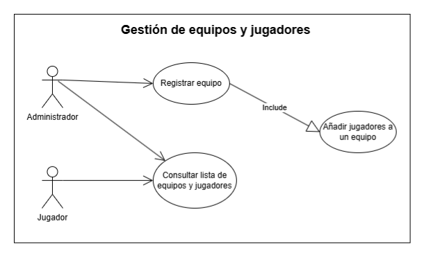

# Sistema de Gestión de Torneos de eSports

## Autor
Lara Serralvo De Jesús

https://github.com/laraserralvo

## Descripción del Proyecto

https://github.com/laraserralvo/torneo-esports-uml

Este proyecto implementa un sistema de gestión de torneos de eSports utilizando 
UML para el modelado y Java para la implementación.

## Análisis del problema y requisitos del sistema

1. ¿Quiénes son los actores que interactúan con el sistema?

    En este caso, los actores que van a interactuar con el sistema son el admistrador
    y los jugadores.

2. ¿Cuáles son las acciones que cada actor puede realizar?

    El administrador va a tener la oportunidad de registrar los equipos, añadir jugadores
    a los equipos y consultar la lista de equipos y jugadores.

    Mientras que los jugadores solamente podrán consultar la lista de equipos y jugadores.

3. ¿Cómo se relacionan entre sí las entidades del sistema?

    Respecto a equipos, un equipo puede estar compuesto tanto por un jugador como por varios
    jugadores, por lo que es una relación de uno a muchos.

    Sin embargo, un jugador tan solo puede pertenecer a un equipo.

## Diagramas UML
### Diagrama de Casos de Uso

### Diagrama de Clases

## Justificación del diseño

### Justificación Diagrama de Casos de Uso

En el diagrama podemos observar que en el sistema de Gestión de equipos y jugadores identifica dos actores; Administrador y Jugador. El Administrador es el responsable de gestionar equipos y jugadores, mientras que el jugador, es el usuario que puede cosultar los equipos y sus jugadores.

En cuanto a los Casos de Uso, Registrar Equipo admite que el Administrador pueda dar de alta un nuevo equipo en el sistema. 

En el caso de Añadir jugadores a un equipo, llega incluido del proceso de registro de un equipo, por ello tiene una relación de tipo include, que permite al Administrador incluir jugadores a la hora de crear un equipo.

Y, por último, Consultar lista de equipos y jugadores permite tanto al Administrador como al Jugador poder ver la información dentro de equipos y jugadores.

Por lo tanto, el Administrador tiene el control de todos los Casos de Uso. Se le permite registrar nuevos equipos y esto incluye en el proceso la acción de añadir jugadores. Edto se ve reflejado mediante la relación include. A su vez, los dos actores tienen acceso a consultar la información de la lista de equipos y jugadores.

### Justificación Diagrama de clases UML

